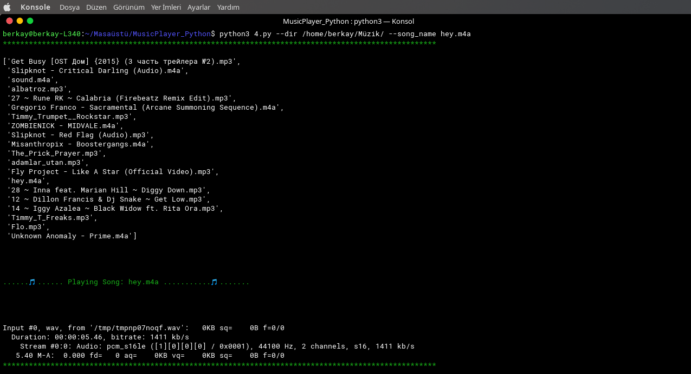

# MPY3 CLI Music Player


**'Just For Fun..' - Linus Torvalds**


MPY3 is CLI music player which made for fun 

## How it works:

you need to install dependencies first:

```bash
pip3 install -r requirements.txt
```


```python
python3 MPY3.py --dir /path/to/music/ --s fav_song.mp3
```

..and it's works..


## What can it do?

Finds media files in target folder using **mimetypes**

Uses **pydub** to play audio files even video formatted ones..


Colorfully prints name of playing song on terminal with **coloroma**

* Default color is GREEN and can be change via editing this line:

* ```py
print(Fore.GREEN + text + Style.RESET_ALL)
```

when you run script it's looks like this:




**MPY3 made in python3 and it's highly recommended for avoiding errors**
